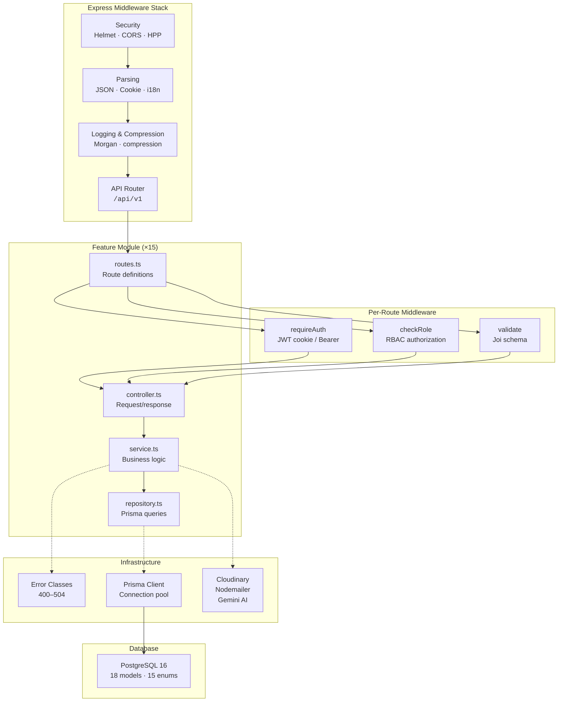

# Nezuko API

Backend REST API powering the Nezuko HR SaaS platform — employee administration, attendance tracking, asset lifecycle, insurance plans, leave requests, project management, payroll with incentives, dynamic reporting, and an AI-powered chatbot assistant.

Built with Express 5, TypeScript 5, Prisma 7, PostgreSQL 16, and a layered module architecture with JWT authentication and RBAC.

---

## Tech Stack

| Category | Technologies |
|----------|-------------|
| **Runtime** | Node.js, TypeScript 5.9 |
| **Framework** | Express 5 |
| **Database** | PostgreSQL 16 (Supabase) |
| **ORM** | Prisma 7 (`@prisma/adapter-pg` connection pooling) |
| **Authentication** | JWT (httpOnly cookies + Bearer token), bcrypt |
| **Validation** | Joi 18 |
| **File Upload** | Multer (memory storage, 5 MB limit, JPEG/PNG/PDF) |
| **Cloud Storage** | Cloudinary |
| **Email** | Nodemailer (Gmail SMTP) |
| **AI / Chatbot** | Google Gemini AI (`gemini-3.1-flash-lite`) |
| **PDF Generation** | PDFKit |
| **Security** | Helmet, CORS, HPP, express-rate-limit, xss-clean, connect-timeout |
| **Logging** | Morgan |
| **i18n** | i18n (English + Arabic) |
| **Infrastructure** | Docker Compose (PostgreSQL 16, Redis 7, Adminer) |

---

## Architecture



### Key Design Decisions

- **Layered module pattern** — every feature follows `routes → controller → service → repository`; no business logic leaks across layers
- **Multi-tenant isolation** — every database model includes a `tenantId` foreign key; all queries are scoped by tenant
- **JWT dual-mode auth** — httpOnly cookie (`jwt`) for browser clients, `Authorization: Bearer` header for API/mobile clients; both verified by the same middleware
- **Global error handling** — 18 custom error classes mapping to HTTP status codes (400–504); i18n-aware error messages; single `globalErrorHandler` middleware
- **Internationalized errors** — error messages support `req.__()` / `res.__()` for English/Arabic; all controllers use translation keys
- **Consistent response shape** — all endpoints return `{ status, message, data?, errors?, code? }` via the global error handler

---

## Authentication & Authorization

```
POST /auth/login → JWT (userId, role, tenantId) → httpOnly cookie (jwt) + Bearer header
                                                           ↓
                                              requireAuth middleware
                                              (cookie || Bearer → verify → req.user)
                                                           ↓
                                              checkRole([TENANT_OWNER, HR_ADMIN, ...])
```

| Layer | Mechanism |
|-------|-----------|
| **Login** | `companyEmail` + `userEmail` + `password` → `POST /auth/login` |
| **Token** | JWT payload: `{ userId, role, tenantId, type: "user" }`; expires in 7 days |
| **Session** | httpOnly `jwt` cookie (`sameSite: strict`, secure in prod) or `Authorization: Bearer <token>` |
| **Middleware** | `requireAuth` — extracts + verifies JWT, attaches `req.user` |
| **Authorization** | `checkRole([UserRole.HR_ADMIN, ...])` — factory that returns 403 `ForbiddenError` |
| **Logout** | `POST /auth/logout` — clears jwt cookie |
| **Roles** | `TENANT_OWNER` · `HR_ADMIN` · `MANAGER` · `EMPLOYEE` |

---

## Internationalization

| Aspect | Configuration |
|--------|---------------|
| **Locales** | English (`en`), Arabic (`ar`) |
| **Detection** | `Accept-Language` header, `lang` query parameter, `locale` cookie |
| **Messages** | Full namespace files: 614 lines (`en.json`), 618 lines (`ar.json`) |
| **Usage** | `req.__("key")` in middleware/controllers, `res.__("key")` in responses |
| **Scope** | All error messages, validation messages, and email templates |

---

## Features

### Auth `/api/v1/auth`

| Endpoint | Method | Auth | Description |
|----------|--------|------|-------------|
| `/auth/login` | POST | Public | Login with company email + user email + password |
| `/auth/logout` | POST | Public | Clear JWT cookie |
| `/auth/me` | GET | Authenticated | Get current user profile |

---

### Dashboard `/api/v1/dashboard`

Executive overview with real-time KPIs and analytics.

| Endpoint | Description |
|----------|-------------|
| `GET /dashboard/overview` | Employee counts, department stats, recent activity |
| `GET /dashboard/metrics/summary` | Aggregated KPI metrics |
| `GET /dashboard/insights` | Business intelligence insights |
| `GET /dashboard/chart` | Chart data for visualizations |
| `GET /dashboard/export` | Export dashboard data |

**Roles:** `TENANT_OWNER`, `HR_ADMIN`, `MANAGER`

---

### Employee `/api/v1/employee`

Full employee lifecycle management.

| Capability | Details |
|------------|---------|
| **Create** | Register employee with role, department, salary, emergency contact |
| **Read** | List (paginated, sortable, filterable) and single employee detail |
| **Update** | Edit personal info, job details, status, role |
| **Delete** | Remove employee record |
| **Documents** | Upload/delete employee documents (JPEG/PNG/PDF, 5 MB) |

**Roles:** `TENANT_OWNER`, `HR_ADMIN`

---

### Department `/api/v1/department`

Hierarchical department management.

| Capability | Details |
|------------|---------|
| **Tree structure** | Parent/child nesting with recursive children |
| **CRUD** | Create, update, delete departments |
| **Manager assignment** | Assign department head |
| **Search / Filter** | By name, parent department |

**Roles:** All authenticated (view), `TENANT_OWNER`, `HR_ADMIN` (mutate)

---

### Company `/api/v1/company`

Tabbed settings: company info, general settings, attendance settings.

| Tab | Fields |
|-----|--------|
| **Company Info** | Name, industry, address, website, logo upload/delete |
| **General Settings** | Language preference, date format, fiscal year start month |
| **Attendance Settings** | Work day start/end, working days, late grace period (min), overtime threshold (hrs), geofence coordinates, location toggle |

**Roles:** All authenticated (view), `TENANT_OWNER`, `HR_ADMIN` (mutate)

---

### Leave Requests `/api/v1/leave-requests`

Employee leave request workflow.

| Endpoint | Description |
|----------|-------------|
| `POST /leave-requests` | Submit leave request (date range, type, reason) |
| `GET /leave-requests` | List leaves (HR: all; employee: own) |
| `GET /leave-requests/:id` | Single leave detail |
| `PATCH /leave-requests/:id/review` | Approve/reject (MANAGER, HR_ADMIN) |
| `DELETE /leave-requests/:id` | Cancel own pending request |

**Roles:** `EMPLOYEE` (submit/cancel), `HR_ADMIN`, `MANAGER` (review)

---

### Attendance `/api/v1/attendance`

GPS-based check-in / check-out with geofence validation.

| Endpoint | Description |
|----------|-------------|
| `POST /attendance/check-in` | Record check-in with latitude/longitude |
| `POST /attendance/check-out` | Record check-out |
| `GET /attendance/timesheet` | All timesheets (HR) or own (employee), date filters |
| `GET /attendance/me` | Personal attendance history |

**Roles:** `EMPLOYEE` (check-in/out), `HR_ADMIN`, `MANAGER` (view all)

---

### Timesheets `/api/v1/timesheets`

Detailed time tracking with approval workflow.

| Endpoint | Description |
|----------|-------------|
| `POST /timesheets` | Create timesheet entry (date, project, task, hours) |
| `GET /timesheets` | List timesheets with filters |
| `PATCH /timesheets/:id` | Edit pending timesheet |
| `PATCH /timesheets/:id/review` | Approve/reject (MANAGER) |
| `GET /timesheets/me` | Personal submission history |
| `GET /timesheets/report/overtime` | Overtime report with department + date filters |

**Roles:** `HR_ADMIN` (submit/manage), `MANAGER` (approve/reject), `EMPLOYEE` (view own)

---

### Asset `/api/v1/asset`

Complete asset lifecycle tracking.

| Capability | Details |
|------------|---------|
| **Register** | Create asset with status, category, purchase info |
| **Assign** | Assign to employee with custody record |
| **Transfer / Return** | Move between employees, record returns with condition notes |
| **My Assets** | View assets assigned to current user (`GET /asset/me`) |
| **Employee Assets** | View assets by employee (`GET /asset/employee/:id`) |
| **Depreciation Report** | Calculated percentage-based depreciation over time |
| **History** | Full custody trail per asset |

**Roles:** `HR_ADMIN` (manage), `MANAGER` (view team), `EMPLOYEE` (view own)

---

### Insurance `/api/v1/insurance-plans` · `/api/v1/insurance-enrollments`

Multi-tier insurance plan management.

| Feature | Details |
|---------|---------|
| **Plans** | BASIC / STANDARD / PREMIUM — coverage details, monthly cost, max dependents |
| **Enrollment** | Enroll employees with dependent selection (spouse, child, parent) |
| **Cost Preview** | Estimated cost before confirming enrollment |
| **Coverage Report** | Overview of all enrollments and plan distribution |
| **My Insurance** | View personal enrollments and dependents |

**Roles:** `HR_ADMIN` (manage), `EMPLOYEE` (view own)

---

### Project `/api/v1/project`

Project and task management.

| Project | Task |
|---------|------|
| Status: PLANNING, ACTIVE, ON_HOLD, COMPLETED, CANCELLED | Status: TODO, IN_PROGRESS, IN_REVIEW, DONE, BLOCKED |
| Progress tracking with percentage | Priority: LOW, MEDIUM, HIGH, URGENT |
| Assign owner, start/due dates | Assignee, subtask support |
| | My Tasks endpoint |
| | Overdue report grouped by project |

**Roles:** `HR_ADMIN`, `MANAGER`, `EMPLOYEE` (assignee)

---

### Payroll `/api/v1/payrolls`

Payroll processing with incentives and deductions.

| Capability | Details |
|------------|---------|
| **Payroll Runs** | Create monthly payroll (DRAFT → APPROVED → PAID) |
| **Incentives** | BONUS, COMMISSION, OVERTIME, DEDUCTION, OTHER — per employee per run |
| **Payslips** | PDF generation via PDFKit |
| **Summary Report** | Aggregated payroll summary by month/year |
| **Calculations** | Base salary + overtime pay + incentives - deductions - insurance |

**Roles:** `TENANT_OWNER`, `HR_ADMIN`

---

### Reports `/api/v1/reports`

Dynamic report generation engine.

| Type | Description |
|------|-------------|
| **headcount** | Employee count by department, role, status |
| **leave-summary** | Leave request statistics by type and status |
| **overtime** | Overtime hours by employee and department |
| **asset-custody** | Asset assignment status and history |
| **task-completion** | Task progress by project and assignee |

| Endpoint | Description |
|----------|-------------|
| `GET /reports` | List available report types + generation history |
| `POST /reports/preview` | Preview report data (paginated) |
| `POST /reports/export/csv` | Export report as CSV |
| `POST /reports/export/pdf` | Export report as PDF |
| `GET /reports/history` | Previously generated reports with re-download |

**Roles:** `HR_ADMIN`, `MANAGER`

---

### Chatbot `/api/v1/chatbot`

AI-powered HR assistant powered by Google Gemini.

| Endpoint | Description |
|----------|-------------|
| `POST /chatbot/message` | Send message, get AI response |
| `GET /chatbot/sessions` | List chat sessions |
| `GET /chatbot/sessions/:id/messages` | Get session message history |

- Markdown rendering for rich responses
- Session persistence
- Rate-limited to 30 requests/minute

**Roles:** All authenticated users

---

### Booking Demo Request `/api/v1/booking-demo-request`

Public endpoint for demo sign-ups.

| Endpoint | Description |
|----------|-------------|
| `POST /booking-demo-request` | Submit demo request (public) |

- Collects full name, email, company, phone, employee count, interests
- Sends email notification to configured recipient

**Roles:** Public

---

## Patterns & Conventions

Every feature follows a consistent layered module structure:

```
feature/
├── routes.ts          # Route definitions with middleware chain
├── controller.ts      # Request/response handling, calls service
├── service.ts         # Business logic layer
└── repository.ts      # Prisma database queries
```

### Middleware Chain

```
route
  → requireAuth          (JWT verification → req.user)
  → checkRole([...])     (RBAC authorization)
  → validate(schema)     (Joi request body validation)
  → controller           (business logic)
  → globalErrorHandler   (catch-all, i18n-aware error response)
```

### Error Handling Pattern

```typescript
// Throw anywhere in service/controller
throw new NotFoundError(req.__("errors.notFound"));

// Global handler catches and returns:
// { status: 404, message: "Resource not found", code?: string, errors?: any[] }
```

### Repository Pattern

```typescript
export async function findById(id: string, tenantId: string) {
  return prisma.user.findFirst({
    where: { id, tenantId },
    include: { department: true },
  });
}
```

---

## Project Structure

```
Nezuko-Api/
├── prisma/
│   ├── schema.prisma              # 18 models · 15 enums
│   └── migrations/                # 14 migration history
│
├── src/
│   ├── server.ts                  # Entry point — HTTP server + DB connect
│   ├── app.ts                     # Express app (middleware stack)
│   │
│   ├── locales/
│   │   ├── en.json                # English (614 lines)
│   │   └── ar.json                # Arabic (618 lines)
│   │
│   ├── modules/                   # Feature modules (x15)
│   │   ├── auth/                  # Login/logout/me
│   │   ├── dashboard/             # KPI overview, metrics, insights, charts, export
│   │   ├── employee/              # CRUD + document upload
│   │   ├── department/            # Hierarchical tree CRUD
│   │   ├── company/               # Info, general, attendance settings
│   │   ├── leave-request/         # Submit, review, cancel
│   │   ├── attendance/            # GPS check-in/out, timesheets
│   │   ├── timesheet/             # Time tracking, approve, overtime report
│   │   ├── asset/                 # Register, assign, transfer, return, depreciation
│   │   ├── insurance/             # Plans, enrollments, dependents
│   │   ├── project/               # Projects, tasks, subtasks
│   │   ├── payroll/               # Payroll runs, incentives, payslips
│   │   ├── reports/               # Preview, export CSV/PDF, history
│   │   ├── chatbot/               # AI assistant (Gemini)
│   │   └── booking-demo-request/  # Public demo sign-up
│   │
│   └── shared/
│       ├── config/                # Prisma, CORS, Cloudinary, mailer, Gemini, i18n
│       ├── middleware/             # requireAuth, checkRole, validate, rateLimiter, upload
│       ├── errors/                 # 18 custom error classes (400–504)
│       ├── interfaces/            # TypeScript interfaces (12 modules)
│       ├── enums/                  # UserRole, Gender, etc.
│       ├── services/              # Email service, tenant setup
│       ├── utils/                 # JWT, bcrypt, helpers, employee code generator
│       └── validations/           # Shared Joi schemas (phone, website)
│
├── docker-compose.yml             # PostgreSQL 16 + Redis 7 + Adminer
├── tsconfig.json                  # ES2020, ESNext modules, @/* path alias
├── prisma.config.ts               # Prisma schema path + direct URL
└── package.json                   # ESM, scripts, dependencies
```

---

## Environment Variables

| Variable | Default | Description |
|----------|---------|-------------|
| `NODE_ENV` | `development` | Environment mode |
| `PORT` | `5000` | Server port |
| `DATABASE_URL` | — | PostgreSQL connection string (PgBouncer) |
| `DIRECT_URL` | — | Direct PostgreSQL connection (no PgBouncer) |
| `ALLOWED_ORIGINS` | — | Comma-separated CORS origins |
| `JWT_SECRET` | — | JWT signing secret |
| `JWT_COOKIE_EXPIRES_IN` | `3` | Cookie expiry in days |
| `SESSION_SECRET` | — | Session secret |
| `SMTP_HOST` | `smtp.gmail.com` | SMTP server |
| `SMTP_PORT` | `587` | SMTP port |
| `SMTP_USER` | — | SMTP email user |
| `SMTP_PASS` | — | SMTP password |
| `SMTP_FROM` | — | From email address |
| `BOOKING_NOTIFICATION_EMAIL` | — | Notification recipient for demo requests |
| `CLOUDINARY_CLOUD_NAME` | — | Cloudinary cloud name |
| `CLOUDINARY_API_KEY` | — | Cloudinary API key |
| `CLOUDINARY_API_SECRET` | — | Cloudinary API secret |
| `GOOGLE_GEMINI_API_KEY` | — | Google Gemini AI API key |

---

## Getting Started

### Prerequisites

- **Node.js** 18+ (LTS recommended)
- **npm**
- **Docker** (for local PostgreSQL + Redis)

### Setup

```bash
# Clone
git clone <repository-url>
cd Nezuko-Api

# Install dependencies
npm install

# Environment (create .env)
cp .env.example .env   # or create manually with vars above

# Start infrastructure
docker compose up -d

# Run migrations
npx prisma migrate deploy

# Seed data (optional)
npm run seed:plans

# Start dev server
npm run dev
```

The server starts on [http://localhost:5000](http://localhost:5000).

### Health Check

```bash
curl http://localhost:5000/health
# → { status: "OK", timestamp: "...", uptime: ... }
```

---

## Docker

A `docker-compose.yml` is provided for local development infrastructure:

```yaml
services:
  db:       # PostgreSQL 16 — port 5432
  redis:    # Redis 7 — port 6379
  adminer:  # Database admin UI — http://localhost:8080
```

```bash
docker compose up -d
```

---

## Available Scripts

| Command | Description |
|---------|-------------|
| `npm run dev` | Start development server with hot-reload (`tsx watch`) |
| `npm run build` | TypeScript compilation to `dist/` |
| `npm start` | Start production server (`dist/server.js`) |
| `npm run seed:plans` | Seed insurance plans |
| `npm run seed:users` | Seed users |
| `npm run seed:subscription` | Seed subscriptions |
| `npx prisma migrate dev` | Create + apply migration |
| `npx prisma studio` | Prisma Studio GUI |

---

## License

ISC
